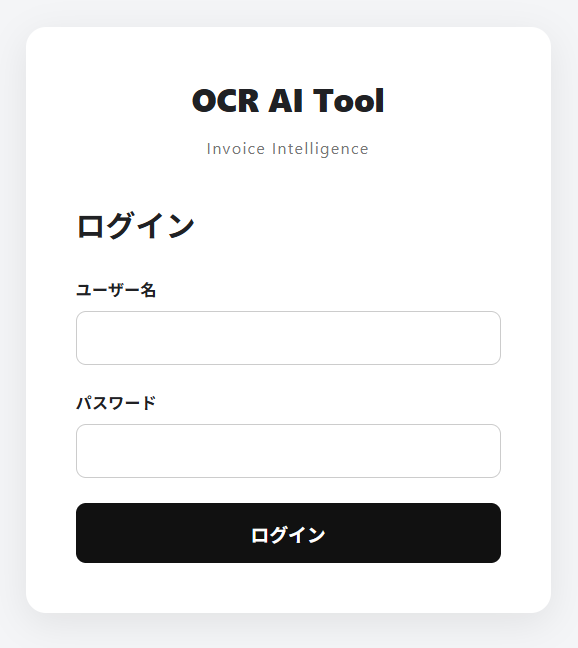
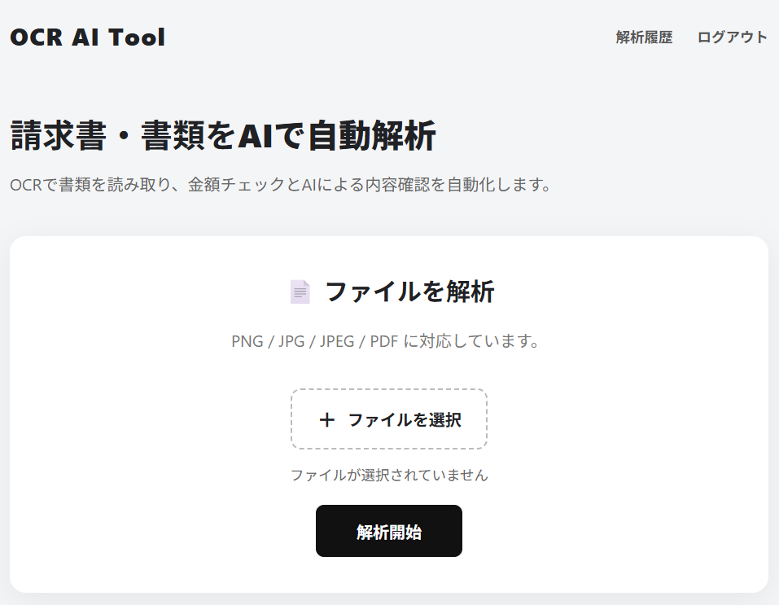
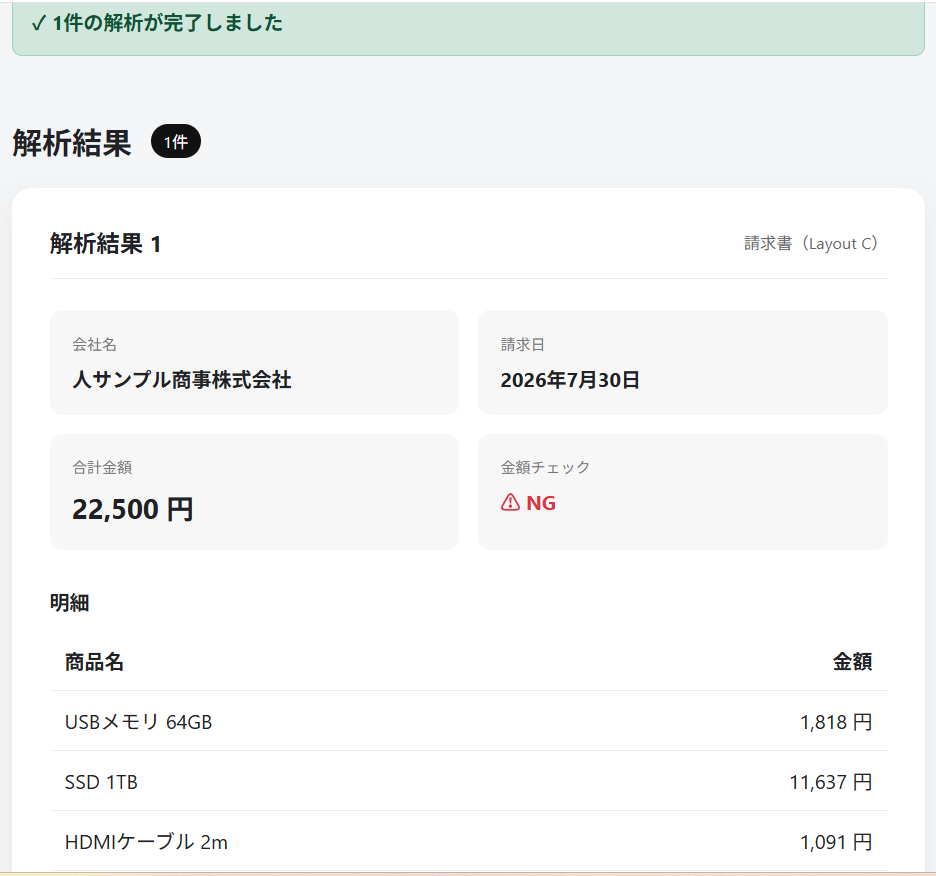
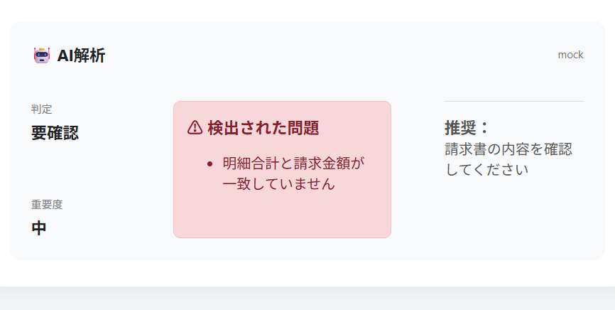
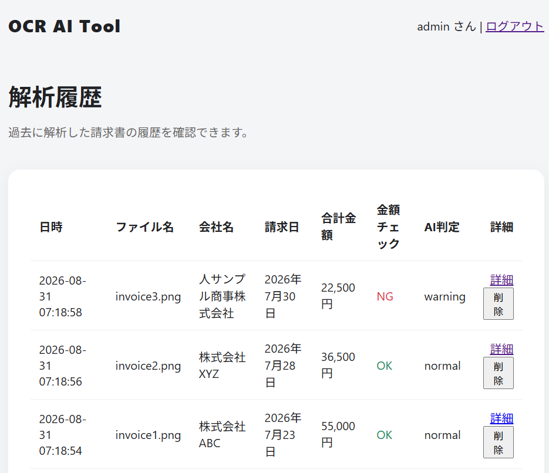
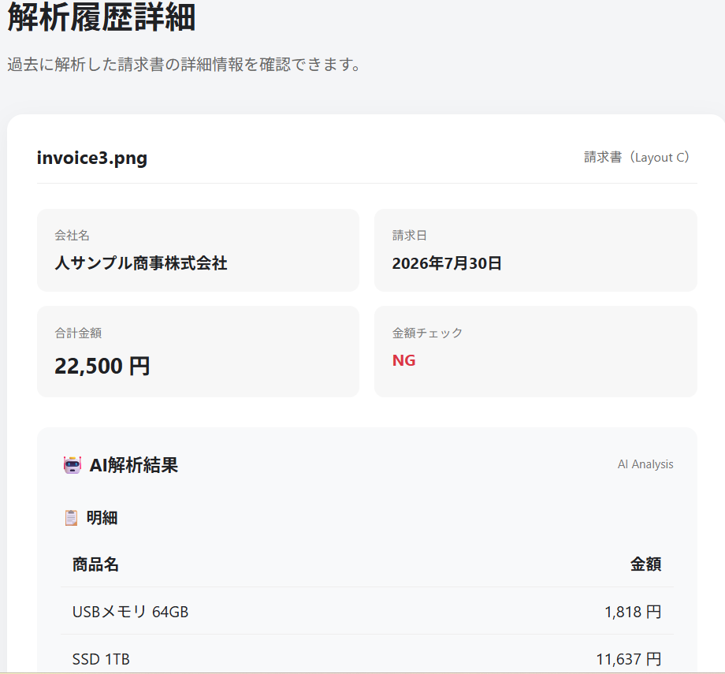
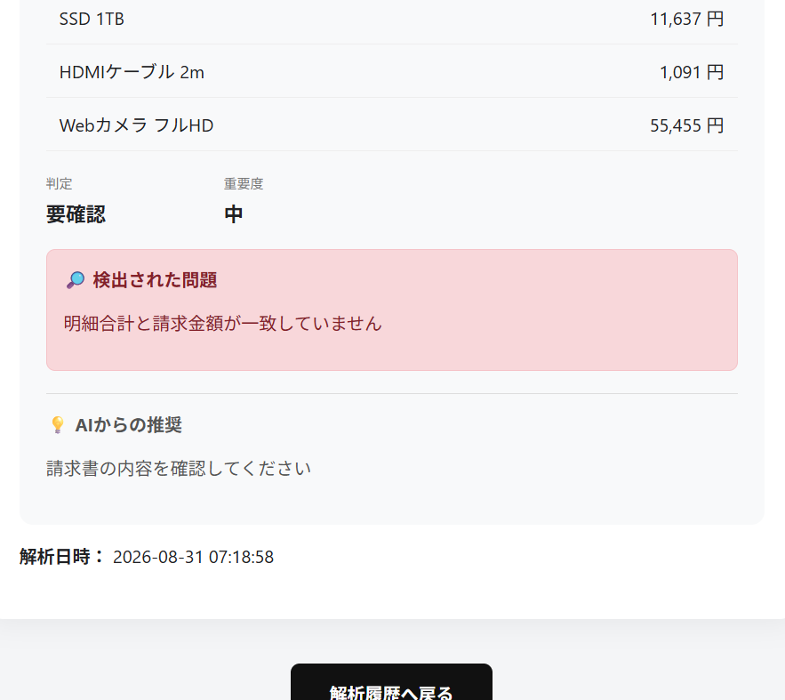

# OCR AI Tool

## 概要

PDFや画像から文字を自動認識（OCR）し、請求書データを抽出・検証してExcelへ出力するWebアプリケーションです。

OCR文字補正、レイアウト判定、形式別データ抽出、金額チェック、AIによる内容確認に加え、ユーザー認証・解析履歴・データベース保存まで実装しています。

複数の請求書フォーマットに対応し、OCRによるデータ入力作業の効率化と、入力内容の確認作業の自動化を目指して開発しています。

---

## 開発目的

クラウドワークスや求人情報を見ている中で、データ入力や書類の転記作業など、手作業で行われている業務が多くあることに気付きました。

Python学習を進める中で、学んだ知識を実際の業務でどのように活用できるのかを考え、PythonとOCR技術を利用して、画像やPDFから必要な情報を取得し、Excelで利用できるデータへ変換する仕組みを開発しました。

単なるOCR処理だけではなく、実際の業務利用を想定し、Webアプリ化、ユーザー認証、データベース保存、解析履歴管理、AIによる内容確認まで段階的に機能を拡張しています。

---

## 主な機能

### OCR・請求書解析

* PDF・画像ファイルの読み込み
* OCRによる文字認識
* OCR文字補正
* 商品名・金額の補正
* 請求書情報の抽出
* 商品明細の抽出
* 金額チェック
* 複数ファイル一括解析

### レイアウト解析

* OCR結果から特徴量を抽出
* レイアウトパターンのJSON管理
* スコアリングによるレイアウト判定
* OCR座標情報を利用した領域分類
* A / B / C形式の自動判定
* レイアウトごとの抽出処理切り替え

### AI解析

* OCR解析結果のAIチェック
* 正常 / 要確認などの判定
* 重要度の判定
* 問題点の表示
* AIからの推奨内容表示
* AI解析結果のデータベース保存

### ユーザー認証

* ログイン機能
* セッション管理
* ログアウト
* パスワードのハッシュ化
* ユーザーごとの解析履歴管理

### データベース

SQLiteを使用し、以下のデータを保存しています。

* ユーザー情報
* 請求書解析履歴
* AI解析結果
* 請求書明細

解析履歴から詳細情報や明細を確認でき、不要な履歴を削除することもできます。

### Excel出力

OCR・解析した請求書データをExcelファイルとして出力できます。

---

## 処理フロー

```text
請求書画像 / PDF
        ↓
   画像前処理
        ↓
       OCR
        ↓
 OCR文字補正
        ↓
   特徴量抽出
        ↓
 レイアウト判定
   (A / B / C)
        ↓
 形式別データ抽出
        ↓
   金額検証
        ↓
    AI解析
        ↓
 SQLiteへ保存
        ↓
 Excel出力
```

---

## 開発ロードマップ

### Lv1：OCR基本機能

* [x] PDF読み込み
* [x] 画像読み込み
* [x] OCRによる文字抽出
* [x] Excel自動出力

### Lv2：請求書OCR機能

* [x] 請求書読み取り
* [x] 項目別データ整理
* [x] Excelフォーマットへの自動入力
* [x] OCR文字補正
* [x] 金額チェック機能
* [x] OCR補正辞書による文字修正
* [x] 商品名補正辞書対応
* [x] 複数請求書処理
* [x] OCR金額異常候補検出

### Lv3：レイアウト解析・Webアプリ化

* [x] レイアウト判定基盤作成
* [x] OCR結果から特徴量抽出
* [x] レイアウトパターンJSON管理
* [x] スコアリングによるレイアウト判定
* [x] OCR座標情報を利用した領域分類
* [x] A / B / C形式ごとの抽出処理
* [x] 複数形式の請求書を自動処理
* [x] StreamlitによるGUI操作
* [x] 複数ファイル一括解析
* [x] Excelダウンロード機能
* [x] FlaskによるWebアプリ化
* [x] ユーザー認証
* [x] パスワードハッシュ化
* [x] SQLiteデータベース導入
* [x] 解析履歴保存
* [x] 履歴詳細表示
* [x] 請求書明細保存・表示
* [x] AI解析結果保存
* [x] 解析履歴削除

### Lv4：AI・モバイル対応

* [ ] AIによる書類レイアウト認識
* [ ] AIによる項目判定
* [ ] 自動データ振り分け
* [ ] LLMによるOCR補正
* [ ] スマートフォンからの請求書撮影・アップロード
* [ ] 未知フォーマットへの対応

---

## 動作確認済み

異なる4種類の請求書フォーマットで動作確認しています。

| ファイル                      | 判定 | 内容          |
| ------------------------- | -- | ----------- |
| invoice1.png              | A  | 基本形式請求書     |
| invoice2.png              | B  | 明細・税情報付き請求書 |
| invoice3.png              | C  | 別レイアウト請求書   |
| invoice4_test_company.png | C  | 別会社フォーマット   |

### 確認項目

* 会社名抽出
* 請求日抽出
* 合計金額抽出
* 商品明細抽出
* 金額チェック
* AI解析
* SQLite保存
* 解析履歴表示
* 履歴詳細表示
* 履歴削除
* Excel出力

---

## 出力例

### 請求書情報

| 書類タイプ         | 会社名         | 請求日        |  合計金額 | 金額チェック |
| ------------- | ----------- | ---------- | ----: | ------ |
| 請求書（Layout A） | 株式会社ABC     | 2026年7月23日 | 55000 | OK     |
| 請求書（Layout B） | 株式会社XYZ     | 2026年7月28日 | 36500 | OK     |
| 請求書（Layout C） | 人サンプル商事株式会社 | 2026年7月30日 | 22500 | NG     |

※ 金額チェックNGは、OCR誤認識や抽出結果の差異を検出し、確認が必要なデータとして表示しています。

### 明細

| 商品名      |    金額 |
| -------- | ----: |
| 商品A      | 50000 |
| HDMIケーブル |  5000 |

---

## Webアプリ画面

### ログイン

ユーザー認証により、ログインしたユーザーのみ請求書解析・履歴確認を行える構成にしています。




### 請求書解析

請求書ファイルをアップロードし、OCR・金額チェック・AI解析を実行します。




### 解析結果

OCRによる請求書情報の抽出、明細表示、金額チェック、AIによる内容確認を行います。




### 解析履歴

過去に解析した請求書を一覧で確認できます。




### 履歴詳細

請求書情報、AI解析結果、請求書明細を確認できます。



---

## 使用技術

| 技術            | 用途               |
| ------------- | ---------------- |
| Python        | メイン開発言語          |
| Flask         | Webアプリケーション      |
| SQLite        | データベース           |
| Tesseract OCR | 文字認識エンジン         |
| pytesseract   | PythonからOCR処理を利用 |
| pandas        | データ処理            |
| openpyxl      | Excel操作          |
| Pillow        | 画像処理             |
| JSON          | OCR補正辞書・設定管理     |
| Werkzeug      | パスワードハッシュ化       |
| Streamlit     | 開発初期のGUI         |
| Git / GitHub  | ソースコード管理         |

---

## システム構成

```text
Webブラウザ
     ↓
   Flask
     ↓
┌───────────────┐
│ OCR解析処理     │
│ レイアウト判定  │
│ 金額検証        │
│ AI解析          │
└───────────────┘
     ↓
   SQLite
     ↓
解析履歴・明細・AI解析結果
     ↓
 Excel出力
```

---

## セキュリティ

ユーザー認証にはFlaskのセッション機能を使用しています。

パスワードは平文では保存せず、Werkzeugのパスワードハッシュ機能を利用してハッシュ化してデータベースへ保存しています。

また、解析履歴や履歴詳細の取得時にはログインユーザーのIDを確認し、ユーザー自身のデータのみ参照できるようにしています。

---

## 工夫した点

### 1. 固定フォーマットに依存しないOCR処理

請求書ごとにレイアウトが異なるため、OCR結果から特徴量を抽出し、レイアウトを判定して処理を切り替える構成にしました。

### 2. OCR誤認識への対応

OCR補正辞書や商品名・金額補正処理を導入し、OCR特有の誤認識を減らす仕組みを実装しました。

### 3. 金額の自動検証

請求書の明細金額と合計金額を比較し、不一致の場合は確認が必要なデータとして表示するようにしました。

### 4. AI解析結果の保存

AIによる判定・重要度・問題点・推奨内容をSQLiteへ保存し、後から解析履歴の詳細画面で確認できるようにしました。

### 5. Webアプリとしての業務利用を想定

OCR処理だけでなく、ログイン、データベース、履歴管理、詳細表示、削除、Excel出力まで実装し、継続的に利用できる業務システムを意識して設計しました。

---

## ディレクトリ構成

```text
ocr-ai-tool
│
├── app.py
├── database.py
├── README.md
├── requirements.txt
├── LICENSE
│
├── data
│   ├── invoice_patterns.json
│   └── layout_patterns.json
│
├── docs
│   └── images
│       └── .gitkeep
│
├── output
│   └── .gitkeep
│
├── sample_data
│   ├── images
│   ├── invoices
│   └── pdf
│
├── templates
│   ├── index.html
│   ├── login.html
│   ├── history.html
│   └── history_detail.html
│
├── static
│   └── style.css
│
└── src
    ├── main.py
    ├── loader.py
    ├── ocr.py
    ├── preprocess.py
    ├── cleaner.py
    ├── detail_cleaner.py
    │
    ├── extractor_a.py
    ├── extractor_b.py
    ├── extractor_c.py
    │
    ├── validator.py
    ├── amount_cleaner.py
    ├── excel.py
    │
    ├── layout_detector.py
    ├── feature_extractor.py
    ├── layout_analyzer.py
    ├── region_detector.py
    ├── region_fusion.py
    │
    └── ocr_dict
        ├── common.json
        ├── invoice.json
        ├── product.json
        ├── amount.json
        └── ocr_corrections.json
```

---

## ▶実行方法

### Flask Webアプリ

```bash
python app.py
```

ブラウザから以下へアクセスします。

```text
http://127.0.0.1:5000/
```

ログイン後、請求書ファイルをアップロードして解析を実行できます。

---

## 今後の改善予定

### OCR精度向上

* 画像前処理の改善
* OCR認識精度の検証
* 補正辞書の拡充
* 商品名・金額補正ルールの強化

### Lv4：AIによる高度化

現在実装しているルールベースのレイアウト判定・抽出処理をさらに発展させ、AIを活用した柔軟な書類解析を目指します。

* AIによる書類レイアウト認識
* AIによる項目抽出
* LLMによるOCR結果補正
* 書類分類機能
* 未知フォーマットへの対応
* スマートフォンからの撮影・アップロード

---

## 学習・開発目的

Pythonによる業務自動化スキルの習得を目的として開発しています。

OCRによる文字認識だけでなく、

* Pythonによるデータ処理
* FlaskによるWebアプリケーション開発
* SQLiteによるデータベース設計
* ユーザー認証
* パスワードハッシュ化
* Git / GitHubを利用した開発管理
* JSONを利用した設定・辞書管理
* 可読性を意識したコード設計

など、実際の業務システム開発を意識して段階的に機能を追加しています。
